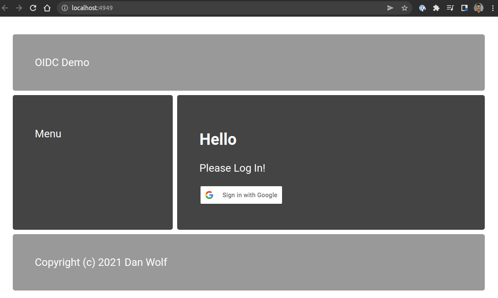

# oidc-demo

This Go project demonstrates the basics of OpenID Connect (OIDC) using GCP with an authorization code flow. 
This is the most secure type of flow where you redirect a user to Google with your client ID, they authenticate,
you get a redirect of the user back to your redirect url with a code, and then you exchange the authorization code 
for a token on the backend.

## Functionality

### Logged out



### OAuth redirect


### Logged in


## Set up a GCP project

### Create Project

Go to the [GCP Developer Console](https://console.cloud.google.com), create a project, and enable the Google+ API.


### Edit app registration

You need to assign the scopes available for request here and add authorized test users as apps in development will 
only allow the listed users to sign in.


### Add OAuth client ID credentials


### Create Client


## Configuration

The following environmental variables are required for operation. Replace the client id, secret, 
and redirect url with the ones selected during your GCP account setup. Note that the redirect URL 
must be absolute (includes port), exact, and you can add more than one in the event you have a localhost
and development url to test with the same application registration. You can use whatever port you want
if it's available, but remember to match the value you used in the redirect during the GCP setup.

```
APP_PORT=4949
CLIENT_ID=123-YOUR_ID-321
CLIENT_SECRET=YOUR_SECRET_PROTECT_IT!
REDIRECT_URL=hhtp://localhost:4949
```

## Sample log output

Produced via logging in and then back out.

```
2022/04/26 17:39:11 Now serving on http://localhost:4949
2022/04/26 17:39:15 serving index: getting session cookie: http: named cookie not present
2022/04/26 17:39:15 serving index: getting session for 
2022/04/26 17:39:15 serving index: this session authenticated? false
2022/04/26 17:43:21 callback: claims loaded from auth provider
2022/04/26 17:43:21 callback: created session 957bdac0-3daf-4b7d-a789-6003889de32d for Dan Wolf (dcwolf@gmail.com)
2022/04/26 17:43:21 serving index: getting session for 957bdac0-3daf-4b7d-a789-6003889de32d
2022/04/26 17:43:21 serving index: this session authenticated? true
2022/04/26 17:45:47 logout: set cookie to expire, now deleting session 957bdac0-3daf-4b7d-a789-6003889de32d
2022/04/26 17:45:47 serving index: getting session cookie: http: named cookie not present
2022/04/26 17:45:47 serving index: getting session for 
2022/04/26 17:45:47 serving index: this session authenticated? false
```
